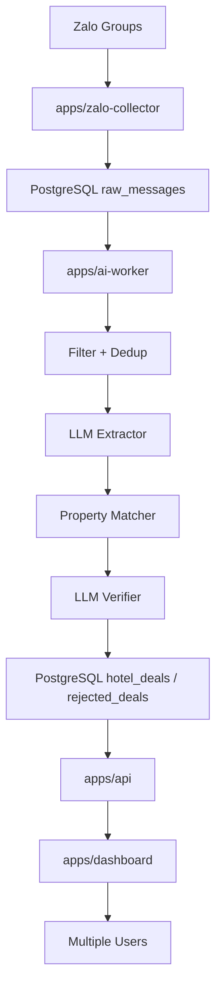

# Hotel Intel Pipeline

This is the proposed clean project structure for the Hotel Intel system.

Folder name:

```text
hotel-intel-pipeline
```

Purpose:

- Capture hotel deal messages from Zalo groups.
- Store raw messages in local PostgreSQL.
- Process messages asynchronously with an AI worker.
- Extract hotel deal data with LLM.
- Match extracted hotel names against the property database.
- Verify medium-confidence matches with LLM true/false.
- Store accepted/rejected results in PostgreSQL.
- Serve a multi-user dashboard through an API.

This folder is a new scaffold. It does not replace the current working collector yet.

## Target Runtime Flow



## Structure

```text
hotel-intel-pipeline/
  apps/
    zalo-collector/       Node.js service. Captures Zalo messages only.
    ai-worker/            Python service. Processes pending raw messages.
    api/                  Python FastAPI backend for dashboard/users.
    dashboard/            Web dashboard for multiple users.

  packages/
    shared/               Shared schemas/contracts.

  infra/
    postgres/             PostgreSQL migrations and local docker config.

  docs/
    ARCHITECTURE.md       System architecture and boundaries.
    DATABASE.md           Database design notes.
    RUNBOOK.md            Local operation notes.

  var/
    logs/                 Local runtime logs. Not source code.
    exports/              Manual exports/backfills.

  scripts/
    backfill/             Replay/reprocess utilities.
    maintenance/          Backup/cleanup scripts.
```

## Clean Architecture Rule

Business rules must not depend on Zalo, the LLM gateway, PostgreSQL, files, or HTTP.

Dependency direction:

```text
interfaces/main
  -> application
    -> domain
  -> ports
  -> infrastructure
```

Allowed:

- Application calls ports.
- Infrastructure implements ports.
- Main wires concrete implementations.

Avoid:

- Domain importing config.
- Domain calling LLM.
- Application importing PostgreSQL client directly.
- Collector calling AI directly in production flow.

## Recommended Services

### 1. Zalo Collector

Responsibility:

- Login/listen to Zalo.
- Normalize messages.
- Insert raw messages into PostgreSQL.
- Exit each handler quickly.

It should not:

- Call LLM.
- Do property matching.
- Write final hotel deals.

### 2. AI Worker

Responsibility:

- Poll `raw_messages` with status `pending`.
- Apply filter/dedup.
- Call LLM extractor.
- Match property.
- Call LLM verifier for score `0.4 - 0.7`.
- Write accepted/rejected result.

Local default:

- Use `9router` as the OpenAI-compatible LLM gateway.
- Dashboard: `http://localhost:20128/dashboard`
- API base URL for the worker: `http://127.0.0.1:20128/v1`

### 3. API

Responsibility:

- Serve dashboard data.
- Handle users/auth.
- Expose review/update endpoints.
- Hide direct database access from users.

### 4. Dashboard

Responsibility:

- Multi-user UI.
- Deal search/filter.
- Rejected review.
- Metrics display.

## Local PostgreSQL As Queue

For the current local-machine deployment, PostgreSQL can act as the durable queue.

Worker query pattern:

```sql
SELECT *
FROM raw_messages
WHERE status = 'pending'
ORDER BY captured_at
FOR UPDATE SKIP LOCKED
LIMIT 10;
```

Benefits:

- No Redis required for MVP.
- Messages survive process restart.
- Easy audit/debug.
- Multiple workers can be added later.

## Migration From Current Project

Move gradually:

1. Keep current `services/zalo-collector` running.
2. Create DB tables from `infra/postgres/migrations/001_initial.sql`.
3. Implement new collector to write `raw_messages`.
4. Move extraction/matching/verification into `apps/ai-worker`.
5. Add API/dashboard against PostgreSQL.
6. Retire JSONL-only output when DB flow is stable.
