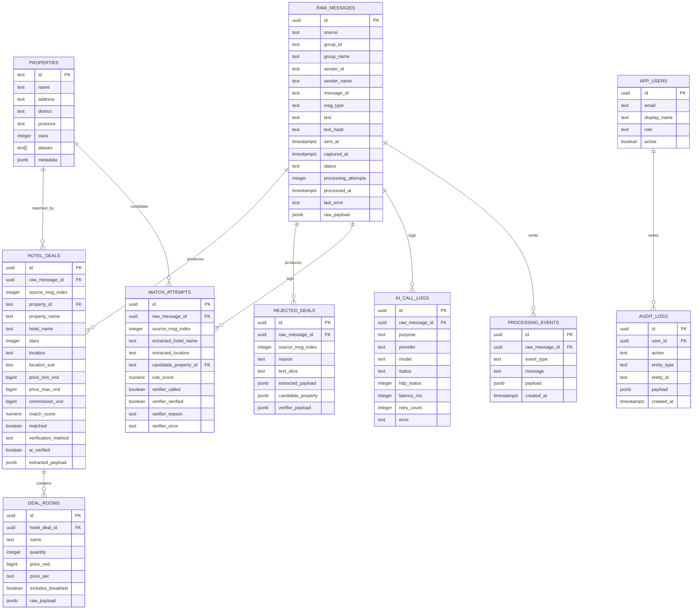
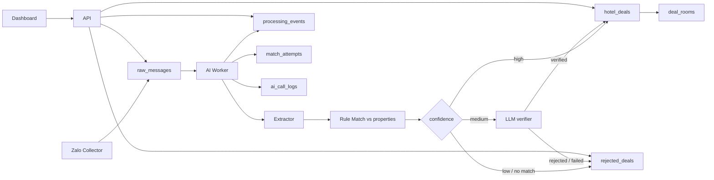
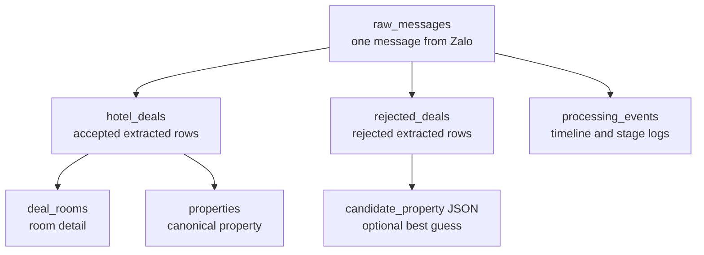

# Database Overview

## Purpose

This document summarizes the PostgreSQL tables used by the hotel-intel pipeline.

It focuses on:

- core entity relationships
- pipeline data flow
- what each table is for

Schema source:

- `infra/postgres/migrations/001_initial.sql`

## Table Groups

### Intake And Queue

- `raw_messages`
  - the system-of-record for captured Zalo messages
  - also acts as the durable job queue for the AI worker

### Master Data

- `properties`
  - canonical hotel/property catalog used for matching

### Processing Output

- `hotel_deals`
  - accepted extracted hotel deals from one raw message
- `deal_rooms`
  - room-level detail rows for one accepted hotel deal
- `rejected_deals`
  - extracted rows that were rejected by rule or verifier

### Matching And AI Observability

- `match_attempts`
  - candidate-match attempts per extracted row
- `ai_call_logs`
  - provider/model/latency/error logs for LLM calls
- `processing_events`
  - stage-by-stage event log for one `raw_message`

### App And Audit

- `app_users`
  - dashboard users
- `audit_logs`
  - user action audit trail

## ER Diagram

## Pipeline Flow

## Review-Oriented View

## Practical Reading Guide

### If You Want To Know What Came In

- start at `raw_messages`

### If You Want Accepted Hotel Rows

- read `hotel_deals`
- then join `deal_rooms`
- optionally join `properties`

### If You Want Rejected Rows

- read `rejected_deals`

### If You Want Why Something Happened

- read `processing_events`
- then `match_attempts`
- then `ai_call_logs`

### If You Want User Review Audit

- read `audit_logs`
- join `app_users`

## Important Cardinality Notes

- one `raw_message` can create many `hotel_deals`
- one `raw_message` can create many `rejected_deals`
- one `hotel_deal` can create many `deal_rooms`
- one `property` can be linked by many `hotel_deals`
- one `raw_message` can have many `processing_events`

## Key Constraints

- `raw_messages`
  - unique: `(source, message_id)`
- `hotel_deals`
  - unique: `(raw_message_id, source_msg_index)`
- `deal_rooms`
  - cascade delete when parent `hotel_deal` is deleted

## Recommended Mental Model

Think about the schema in three layers:

1. `raw_messages` is the intake and queue layer
2. `hotel_deals` and `rejected_deals` are the decision/output layer
3. `processing_events`, `match_attempts`, and `ai_call_logs` are the observability layer
